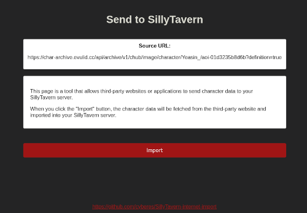

# sillytavern-internet-import

_A plugin to allow internet websites to send cards to your SillyTavern server._

## Installation

1. Download `internet-import.js` from the latest release on the [releases tab](https://git.evulid.cc/cyberes/sillytavern-internet-import/releases)
2. Place `internet-import.js` in the `plugins/` directory
3. Open `config.yaml` and change `enableServerPlugins` to `true`
4. Start SillyTavern. You should see `[Internet Import] Plugin loaded!` in the console if the plugin was loaded successfully

To build `internet-import.js` yourself:
1. `npm install`
2. `npm run build`
3. Output will be in the `dist/` directory

## Usage

A bot hosting website should give a link to your SillyTavern server with the URL of the character card PNG filled out:

`<your sillytavern server host>/api/plugins/internet-import/import?url=<character PNG url>`

Clicking that link will open the import URL for your SillyTavern server in a new tab. Confirm the URL that it wants to import and click the `Import` button.

## Developers

It's easy to support this plugin on your bot-hosting website. Simply ask the user for their SillyTavern server host (default is `http://localhost:8000`) and give a link to their import page.

The `url` query arg should be double-encoded, ie. `encodeURIComponent(encodeURIComponent())`, to prevent any special characters from interfering with the query. 